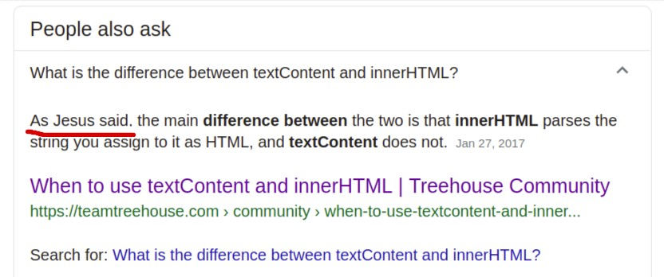

# Front end Engineer Challenge

You can submit all the answers to this assignment in a single repository (or as a zipped folder), containing markdown and code.

## 1. About you

I haven't worked commercially with **Vue.js** or **AngularJS**, but I worked for two years with another modern framework, **Meteor JS**. Our company developed a time tracking solution for use in the field. We developed an online admin dashboard as well as a hybrid mobile app for use on the field.  
Prior to that I did basic web development for a college, developed a small app to receive a grant and even had a short stint developing scripts for an automation system. That last one rekindled my love for web development and set me on track for my current career as a **Front-End Developer** with a bit of Full-Stack sprinkled in.
Currently, I'm back to the basics working with **jQuery** on an online document collaboration tool.  

## 2. General

##### 2.1. What kind of front end projects do you enjoy working on? Why?

I enjoy working on projects that are well structured and well-tested because you can do a lot of changes quickly and easily and keep up with the ever changing eco-system of startups. I think it's important for projects to not fall victim to the [broken window theory](https://en.wikipedia.org/wiki/Broken_windows_theory).  
I lean most towards the engineering part of Front-End Development, so I like working on Web-Apps with a lot of JS under the hood vs Web-pages.  
That being said, I also like delivering a beautiful experience to users, but I am not good enough of a designer to create my own design mockups and I mostly copy paste pretty CSS from Codepen.  

##### 2.2. Which are your favorite features of HTML5? How have you used them before?

I think the semantic elements(`<footer>`, `<header>`, `<main>`, etc) were a much needed addition and necessary for structuring content.  
I also love the new input types and their built-in capability for input formatting and validation.
`<canvas>` is great for games, I have used it in a small toy project https://codepen.io/faysvas/pen/yaApdE

##### 2.3. Explain the difference between creating a DOM element setting `innerHTML` and using `createElement`.

I honestly don't know, so time to learn something new. I'm off for some googling...

Wait, what? Can't argue with Jesus, so there's your answer.
Oh, Jesus is just some developer from Madrid. Ok, moving on...

According to the MDN Web Docs:

> The Element property `innerHTML` gets or sets the HTML or XML markup contained within the element.

while

> In an HTML document, the `document.createElement()` method creates the HTML element specified by `tagName`, or an `HTMLUnknownElement` if `tagName` isn't recognized.

`innerHTML` can pose some security risks if you are posting user generated code so you should be sure to sanitize the text.

Because `innerHTML` causes the user agent to do these steps

> -   The specified value is parsed as HTML or XML (based on the document type), resulting in a DocumentFragment object representing the new set of DOM nodes for the new elements.

-   If the element whose contents are being replaced is a <template> element, then the <template> element's content attribute is replaced with the new DocumentFragment created in step 1.
-   For all other elements, the element's contents are replaced with the nodes in the new DocumentFragment.

It may be better to user `createElement` because it preserves existing references to DOM elements and event handlers when appending elements.
`createElement` may also be faster when adding a lot of elements, because the browser doesn't have to do all the steps described above.

##### 2.4. Compare two-way data binding vs one-way data flow.

-   **One-way data flow** means that the model is the single source of truth and data flows from the model to the view(UI).
    When the UI is changed (ex. through user input), an event is triggered that notifies the model of the change, and the model decides if it will change the app's state.

-   **Two-way data binding** means that the UI and model are connected and update each other automatically.

Two-way data binding might seem more convenient (and require less code), but that is probably only true for connected elements in small, self-contained components. Two-way data binding between multiple components may cause confusion and be more difficult to debug, especially in larger applications.  
If you have two-way data binding between numerous components in a large application, you can not be sure about the state in any given moment. Whereas with one-way data flow you just need to check your state object.

##### 2.5. Why is asynchronous programming important in JavaScript?

**JavaScript** is mainly used for highly reactive web apps that include a lot of user interaction and run on all sorts of devices. The web involves a lot of delay and waiting (especially when you have a slow connection. With asynchronous programming, script execution doesn't need to be blocked while you're waiting for something that takes a lot of time, like a server or user response.  
So asynchronous programming allows you, for example, to fetch and display one paragraph of content for your user to read while the rest of the content is loading.  
JavaScript is a synchronous, single-threaded language by default but various browser APIs provide us with the much needed asynchronicity.

## 3. Styling

Given the HTML file **front-end/q3/q3.html**, implement the styling so the page matches the image below.


#### Bonus

-   Implement styling rules that consider different screen sizes.

**Notes:**

-   The footer should stick to the bottom when scrolling. - **DONE**
-   You can, and should, use a CSS pre-processor, such as SASS or LESS. - **DONE**

## 4. SPA

Using Vue.js or AngularJS, implement an SPA that gets information from a server (explained below) and has the following pages:

### Books list

Display all available books returned from the API. - **DONE**

-   Synopsis should be truncated at 200 characters. - **DONE**
-   Book's title and cover should link to the book's individual page. - **DONE**
-   Though the upvote functionality is not required, the upvote state should be represented. - **DONE**


### Book page

Display a single book information, highlighting the cover and displaying the full synopsis. - **DONE**


The upvote functionality is **not** required, the UI should only reflect if a book has been upvoted yet or not. - **DONE**
For this question, you **don't** have to replicate the example screens above, feel free to implement any design that you'd like.

**Important notes:**

-   Add test coverage as you see fit; - **DONE**
-   You may use TypeScript instead of plain JS; - **JUST USED JS**
-   Use a CSS pre-processor; - **DONE**
-   Your app must be responsible for all of it's dependencies and they should be installed via `yarn` or `npm install`. The app must run by using either `yarn start` or `npm start`. - **DONE**

#### Bonus

-   Implement text search on the books list (for title and synopsis) - Add filter on top - **DONE only for title**
-   Add pagination on the books list - Have a button where user picks how many books he wants to see
-   Add a comments section on the book page - Allow user to add comment but not save them anywhere when app closes

### Server

In order to solve this problem, a simple server is provided, which you should use to get the data.
Head into `front-end/q4/server` and install the server dependencies using:

```bash
yarn install
```

or

```bash
npm install
```

Run the server using:

```bash
yarn server
```

or

```bash
npm run server
```

The server should be running on port `3000`.

#### Available routes

#### http://localhost:3000/books

Returns a list of books, with their info.

#### http://localhost:3000/books/SLUG

Returns the book information for the given SLUG (404 otherwise).

## Instructions for Q4

### SPA

The project is located in `q4/vuejs-books`.

Install dependencies with

```bash
npm install
```

and start the app with

```bash
npm start
```

## Tests

With the **book server** and **project server** still running, you can run some tests.

I used **Cypress** for **E2E** tests. You can start them up with

```bash
npm run e2e-tests
```

and you can run some **Jest** **Unit** tests in the console with

```bash
npm run unit-tests
```
